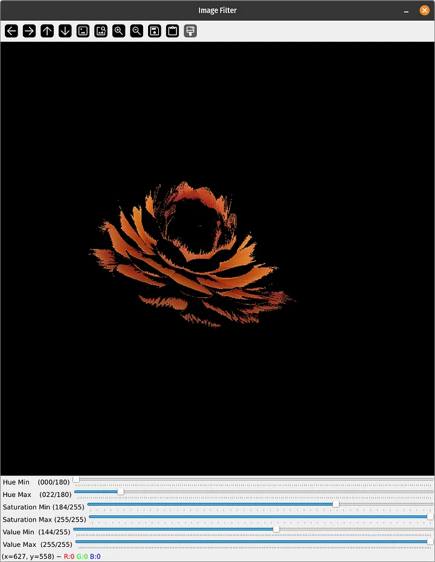

# OpenCV HSV Filter

This project shows how to use OpenCV Python trackbars / sliders to tune thresholds for an HSV color filter.

## Requirements

The only requirement is `opencv-python` in the `requirements.txt` file.
Run `pip install -r requirements.txt` to install the dependency.

## Quickstart

Run `python main.py` to start the GUI sample with the flower image.

## Trackbar Sample Code

Checkout the `trackbar_explicit.py` and `trackbars_from_array.py` for alternative sample code to setup the trackbars